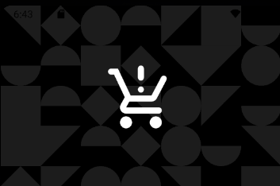
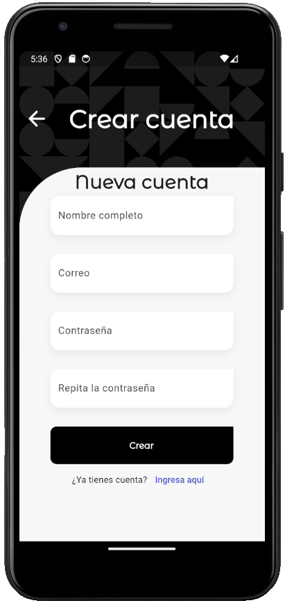
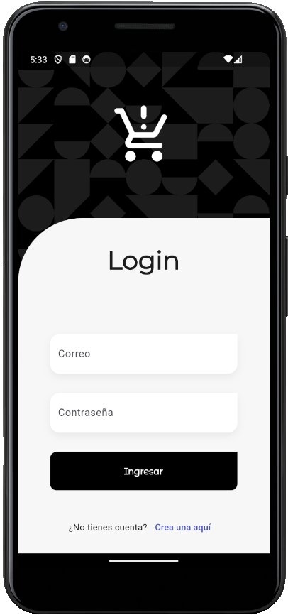
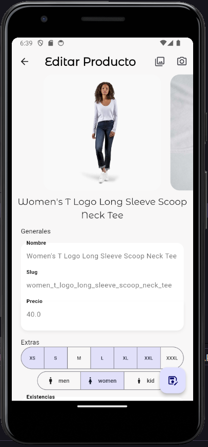

# Flutter TesloShop

Flutter TesloShop es una aplicación de E-commerce desarrollada con Flutter en la que se pueden desarrollar interacciones simuladas de compra online desde una app movile.

En este proyecto se trabaja con:

* Cámara
* Tokens de acceso
* CRUD (Create Read Update Delete) Rest API Endpoints
* Riverpod
* GoRouter

# Diseño 📱

# Implementaciones 🛠️

* Authentication - JWY - Riverpod
* GoRouter - Protección de rutas
* Crear y actualizar productos
* Cámara, galería y carga de archivos

# Funcionalidad 🚀

## El backend se puede obtener de aquí 🖥️

[Teslo Backend - Nest RestServer](https://github.com/jllanas1986/Flutter-backend-teslo-shop)

# Importante❗
Recuerdad leer y seguir la guía para montar el backend localmente.

## Recursos 📚

[Udemy](https://www.udemy.com/)

## Autor ✒️

- **Jose Llanas** - [jllanas1986](https://github.com/jllanas1986)