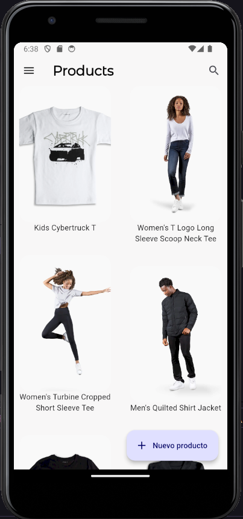

# Flutter TesloShop

Flutter TesloShop es una aplicación de E-commerce desarrollada con Flutter en la que se pueden desarrollar interacciones simuladas de compra online desde una app movile.

En este proyecto se trabaja con:

* Cámara
* Tokens de acceso
* CRUD (Create Read Update Delete) Rest API Endpoints
* Riverpod
* GoRouter

# Diseño 📱

# Implementaciones 🛠️

* Authentication - JWY - Riverpod
* GoRouter - Protección de rutas
* Crear y actualizar productos
* Cámara, galería y carga de archivos

# Funcionalidad 🚀

[registerlogin](https://github.com/jllanas1986/Flutter_Teslo_shop/assets/122029674/4ae6f04c-7789-4c6b-8fa7-011b2078fa2a)

[actualizar y cámara](https://github.com/jllanas1986/Flutter_Teslo_shop/assets/122029674/79bd8c57-5fe3-43ea-ab80-cceed48e90ef)

[crear y galería](https://github.com/jllanas1986/Flutter_Teslo_shop/assets/122029674/cc39d413-1643-4477-b122-b0445fbbe08a)

[cerrar sesión](https://github.com/jllanas1986/Flutter_Teslo_shop/assets/122029674/5f7ae41a-55d9-4fbf-961a-2b58b38eb492)

## El backend se puede obtener de aquí 🖥️

[Teslo Backend - Nest RestServer](https://github.com/jllanas1986/Flutter-backend-teslo-shop)

# Importante❗
Recuerdad leer y seguir la guía para montar el backend localmente.

## Recursos 📚

[Udemy](https://www.udemy.com/)

## Autor ✒️

- **Jose Llanas** - [jllanas1986](https://github.com/jllanas1986)
